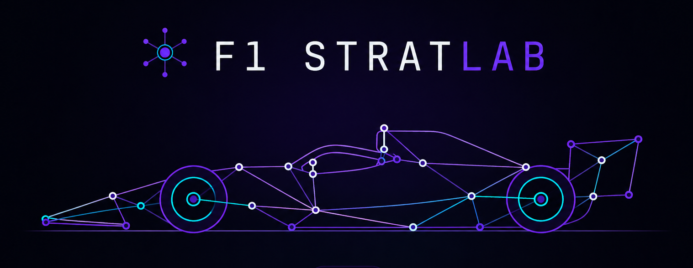

<div align="center">

# F1 StratLab

### *Race strategy, decided by six agents.*

[](https://www.python.org/) [](https://streamlit.io/) [](https://pytorch.org/) [](https://github.com/theOehrly/Fast-F1) [](LICENSE) [](https://deepwiki.com/VforVitorio/F1-StratLab)

F1 StratLab orchestrates seven ML models and a LangGraph multi-agent system to produce real-time Formula 1 strategy recommendations — from lap time prediction to tire degradation, radio NLP, and RAG over FIA regulations.

[Landing page](https://vforvitorio.github.io/f1stratlab-web/) · [Full documentation (DeepWiki)](https://deepwiki.com/VforVitorio/F1-StratLab) · [Paper](documents/docs_legacy_strat_manager/F1_Strategy_Manager_AI.pdf) · [Hugging Face dataset](https://huggingface.co/datasets/VforVitorio/f1-strategy-dataset)

</div>

<div align="center">
  <a href="https://vforvitorio.github.io/f1stratlab-web/">
    
  </a>
</div>

---

## What it is

In Formula 1, strategic decisions must be made within seconds while juggling weather, tire wear, track position, and fuel. **F1 StratLab** packages a multi-agent AI system (seven specialised agents coordinated by an orchestrator) plus a 2D race replay and a post-race analytics UI into a single repository. Data comes from FastF1 and OpenF1; models span XGBoost, TCN + MC Dropout, LightGBM, RoBERTa / SetFit / BERT-large, Whisper, and FIA RAG over Qdrant.

See [`ARCHITECTURE.md`](ARCHITECTURE.md) for the one-page topology and [`docs/`](docs/) for the deep dives.

## Three surfaces, one codebase

| Surface                            | Command                                                                                                     | When to use                                                                                          |
| ---------------------------------- | ----------------------------------------------------------------------------------------------------------- | ---------------------------------------------------------------------------------------------------- |
| **CLI**                      | `f1-sim VER Melbourne "Red Bull Racing" --year 2025`                                                      | Headless Rich-based live inference panel for a single race.                                          |
| **Arcade** (primary live UI) | `f1-arcade --viewer --year 2025 --round 3 --driver VER --team "Red Bull Racing" --driver2 LEC --strategy` | Three-window 2D race replay + PySide6 strategy dashboard + live telemetry grid. No backend required. |
| **Streamlit** (post-race)    | `docker compose up` *or* `f1-streamlit`                                                               | Analytics dashboard, chat Q&A, model lab, voice mode. Backed by FastAPI.                             |

## How to run

**CLI** — install the wheel, then run the simulator:

```bash
uv tool install "git+https://github.com/VforVitorio/F1-StratLab.git"
f1-sim
```

**Arcade** — same install drops `f1-arcade` on PATH:

```bash
uv tool install "git+https://github.com/VforVitorio/F1-StratLab.git"
f1-arcade
```

**Streamlit** — clone and bring the stack up with Docker:

```bash
git clone https://github.com/VforVitorio/F1-StratLab.git && cd F1-StratLab
docker compose up
```

Requires Python 3.10 / 3.11 and an `OPENAI_API_KEY` (or `F1_LLM_PROVIDER=lmstudio`). Full options (pip fallback, local Streamlit, data bootstrap) in [`INSTALL.md`](INSTALL.md).

## Project layout

- [`src/arcade/`](src/arcade/) — 2D race replay (pyglet) + PySide6 strategy dashboard
- [`src/agents/`](src/agents/) — multi-agent orchestrator (N25 → N31)
- [`src/simulation/`](src/simulation/) — `RaceReplayEngine` + `RaceStateManager`
- [`src/telemetry/`](src/telemetry/) — FastAPI backend + Streamlit post-race UI (git submodule)
- [`src/nlp/`](src/nlp/) — radio transcription + sentiment/intent/NER pipeline
- [`src/rag/`](src/rag/) — Qdrant retriever over FIA sporting regulations
- [`src/f1_strat_manager/`](src/f1_strat_manager/) — CLI infrastructure (data bootstrap, GP slug resolver)
- [`scripts/`](scripts/) — CLI entry points and maintenance tools
- [`docs/`](docs/) — architecture, API reference, arcade guides, draw.io diagrams

## Contributing

See [`CONTRIBUTING.md`](CONTRIBUTING.md) for dev setup, code-style rules, and the untouchable-files list. Bug reports, feature ideas, and data anomalies go through the templates under [.github/ISSUE_TEMPLATE/](.github/ISSUE_TEMPLATE/).

## Related

This project is part of a broader F1 AI suite:

- [F1 StratLab (this repo)](https://github.com/VforVitorio/F1-StratLab) — strategy engine
- [F1 Telemetry Manager](https://github.com/VforVitorio/F1_Telemetry_Manager) — FastAPI backend + Streamlit post-race UI, vendored here under [`src/telemetry/`](src/telemetry/) as a git submodule
- [F1 AI Team Detection](https://github.com/VforVitorio/F1_AI_team_detection) — YOLOv12 team identification from race footage
- [F1 Strategy Dataset (Hugging Face)](https://huggingface.co/datasets/VforVitorio/f1-strategy-dataset) — trained weights and processed race data

## About

**Final Degree Project (Trabajo Fin de Grado)** — Fourth year, Grado en Ingeniería de Sistemas Inteligentes. Feedback, suggestions and contributions are welcome via the issue templates.

---

> **Disclaimer — no copyright infringement intended.** Formula 1, F1, and related marks are trademarks of Formula One Licensing B.V. and are used here for reference only. All race data is sourced from public APIs (FastF1, OpenF1) and is used strictly for educational and non-commercial purposes. This project is not affiliated with, endorsed by, or in any way officially connected to Formula 1, the FIA, or any F1 team.
