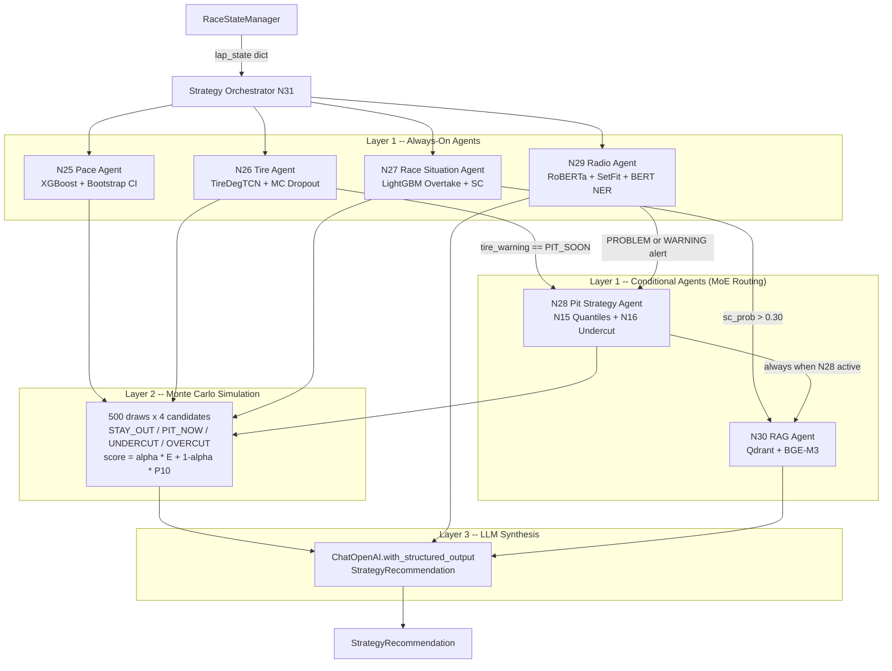
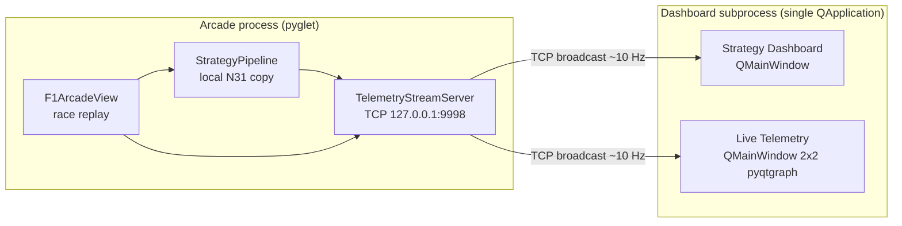

# Multi-Agent Strategy Architecture (N25--N31)

## Purpose

The multi-agent system replaces the legacy Experta rule engine (`base_agent.py`, `strategy_agent.py`) with a LangGraph-based pipeline that combines ML model inference, Monte Carlo simulation, and LLM-driven synthesis to produce race strategy recommendations.

## System Overview



## Three-window arcade

Since Phase 3.5 Proceso B (April 2026), the `python -m src.arcade.main ... --strategy`
launcher runs three windows driven by one shared telemetry stream. The layout is:



Four properties are load-bearing:

1. **The arcade owns the `TelemetryStreamServer`.** `src/arcade/stream.py` exposes the
   merged arcade + strategy snapshot; every other window is a subscriber, never the
   source of truth.
2. **One subprocess hosts both Qt windows.** The arcade spawns a single
   `subprocess.Popen` that boots one `QApplication`. Two windows inside one event loop is
   cheaper than two OS processes and avoids duplicated imports of PySide6 + pyqtgraph.
3. **Each window has its own `TelemetryStreamClient(QThread)`.** Subscribers do not
   share sockets; each window reconnects independently when the arcade restarts, which
   keeps the dashboard and telemetry windows decoupled.
4. **Arcade runs a local strategy pipeline.** `src/arcade/strategy_pipeline.py` carries a
   copy of the N31 orchestrator body so the arcade does not depend on the FastAPI
   backend at runtime. See [`docs/strategy-pipeline-arcade.md`](strategy-pipeline-arcade.md)
   for the rationale and [`docs/arcade-dashboard.md`](arcade-dashboard.md) for the
   Qt-side architecture.

See [`docs/diagrams/`](diagrams/) for the full drawio visuals (window layout, data flow,
subprocess lifecycle).

## Agent Details

### N25 -- Pace Agent (`pace_agent.py`)

Wraps the N06 XGBoost delta-lap-time model. Returns predicted lap time, delta signals against previous lap and session median, and bootstrap confidence intervals (N=200 draws with 2% Gaussian noise on continuous features).

- **Model**: XGBoost trained on 2023--2025 lap data
- **Output**: `PaceOutput` (lap_time_pred, delta_vs_prev, delta_vs_median, ci_p10, ci_p90)

### N26 -- Tire Agent (`tire_agent.py`)

Wraps per-compound TireDegTCN models (N09/N10) with MC Dropout inference. Answers: how many laps remain before the degradation cliff?

- **Model**: Causal TCN per compound + Platt calibration
- **Output**: `TireOutput` (laps_to_cliff_p10/p50/p90, warning_level, deg_rate)
- **Warning levels**: OK, MONITOR, PIT_SOON, CRITICAL

### N27 -- Race Situation Agent (`race_situation_agent.py`)

Combines N12 (overtake probability via LightGBM) and N14 (safety car probability via LightGBM) into a single threat assessment per lap.

- **Models**: LightGBM overtake (AUC-PR 0.5491) + LightGBM SC (AUC-PR 0.0723)
- **Output**: `RaceSituationOutput` (overtake_prob, sc_prob_3lap, threat_level)

### N28 -- Pit Strategy Agent (`pit_strategy_agent.py`)

Wraps N15 (physical pit stop duration P05/P50/P95 via HistGBT) and N16 (undercut success probability via LightGBM). Recommends when to pit, what compound to fit, and whether to undercut.

- **Models**: HistGBT quantile pit duration + LightGBM undercut
- **Output**: `PitStrategyOutput` (action, compound_recommendation, stop_duration_p05/p50/p95, undercut_prob)
- **Activation**: conditional -- only runs when tire_warning is PIT_SOON or radio flags PROBLEM/WARNING

### N29 -- Radio Agent (`radio_agent.py`)

Two-stream NLP pipeline. Driver radio goes through RoBERTa-base sentiment, SetFit intent classification, and BERT-large NER. Race Control Messages go through a deterministic rule-based parser. Alerts are built deterministically from NLP is_alert flags -- the LLM cannot miss or hallucinate alerts.

- **Models**: RoBERTa-base, SetFit, BERT-large-conll03 (radio); rule parser (RCM)
- **Output**: `RadioOutput` (radio_events, rcm_events, alerts, corrections)

### N30 -- RAG Agent (`rag_agent.py`)

Answers regulation questions by retrieving relevant FIA Sporting Regulation passages from a local Qdrant vector store (built by `scripts/build_rag_index.py`), using BGE-M3 embeddings and a LangGraph ReAct agent.

- **Retriever**: Qdrant + BGE-M3 embeddings
- **Output**: `RegulationContext` (answer, articles, chunks)
- **Activation**: conditional -- only runs when sc_prob > 0.30 or N28 is active

### N31 -- Strategy Orchestrator (`strategy_orchestrator.py`)

Three-layer pipeline:

1. **MoE Routing**: deterministic if-else rules decide which conditional agents (N28, N30) to activate based on always-on agent outputs.
2. **Monte Carlo Simulation**: draws 500 samples from sub-agent probability distributions and evaluates four strategy candidates (STAY_OUT, PIT_NOW, UNDERCUT, OVERCUT). Score = alpha * E[S] + (1-alpha) * P10[S].
3. **LLM Synthesis**: structured-output LLM aggregates all reasoning strings and MC scores into a `StrategyRecommendation`.

- **Output**: `StrategyRecommendation` (action, reasoning, confidence, scenario_scores, contingencies)
- **Action values**: STAY_OUT, PIT_NOW, UNDERCUT, OVERCUT, ALERT
- **Pace modes**: PUSH, NEUTRAL, MANAGE, LIFT_AND_COAST
- **Risk levels**: AGGRESSIVE, BALANCED, DEFENSIVE

## RSM Adapter Pattern

Every agent exposes two entry points:

```python
# FastF1 entry point (requires populated module globals)
run_*_agent(lap_state)

# RSM adapter (no FastF1 session required, works from parquet)
run_*_agent_from_state(lap_state, laps_df)
```

The RSM adapter builds `SESSION_META` from `laps_df` and calls the same core logic. The orchestrator uses `run_strategy_orchestrator_from_state(race_state, laps_df)` for the full pipeline.

## LLM Configuration

| Layer | Model | Provider |
|---|---|---|
| Sub-agents N25--N29 | gpt-4.1-mini | OpenAI or LM Studio |
| Orchestrator N31 | gpt-5.4-mini | OpenAI or LM Studio |

Set `F1_LLM_PROVIDER=openai` env var to use the real OpenAI API. Default is LM Studio at `http://localhost:1234/v1`.

## Data Flow

```
data/raw/2025/<GP>/laps.parquet
       |
  RaceReplayEngine --> RaceStateManager.get_lap_state()
       |
  lap_state dict --> Strategy Orchestrator
       |
  StrategyRecommendation --> FastAPI /api/v1/strategy/recommend
       |
  JSON response --> Streamlit Strategy Page
```

## References

- Heilmeier et al. (2020) ApplSci 10/4229 -- MC motorsport simulation
- Wang et al. (2024) arXiv:2406.04692 -- MoA reasoning aggregation
- Liu et al. (2024) arXiv:2402.02392 -- DeLLMa decision under uncertainty with LLM
