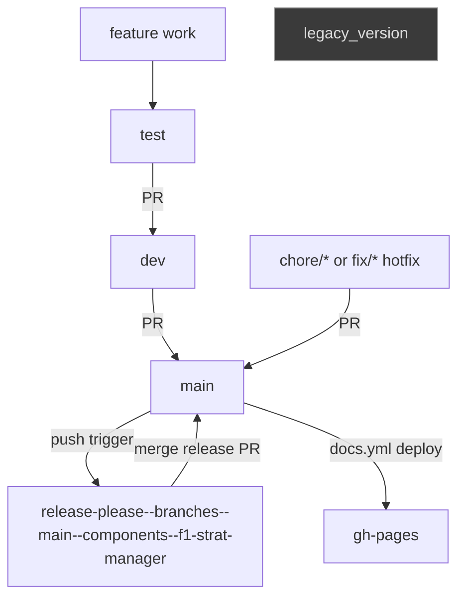
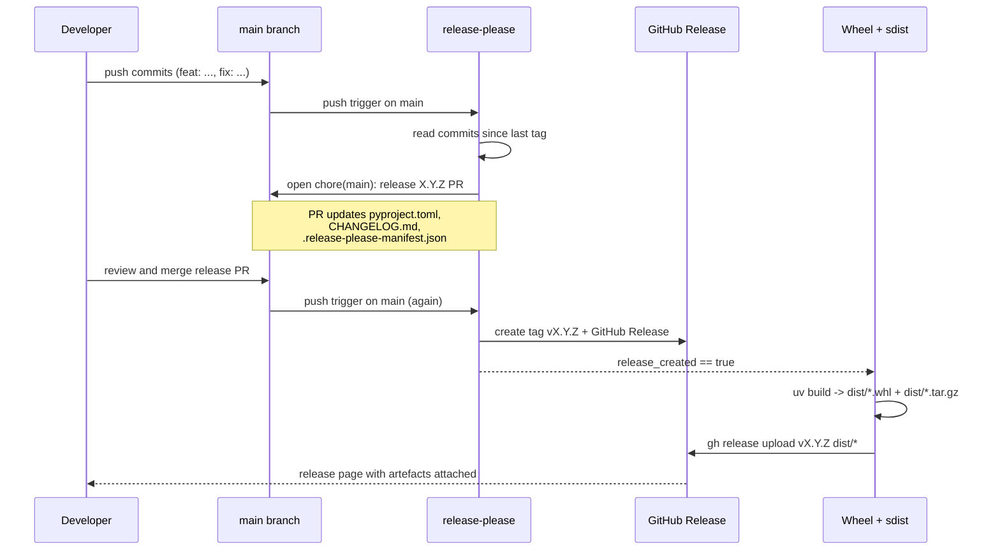

# CI/CD pipeline

Single source of truth for how F1 StratLab is built, tested, released and deployed. Read this once and you will know how a commit becomes a published release and the live docs site.

The pipeline is split across three GitHub Actions workflows, a release-please bot for versioning, Dependabot for dependency hygiene, and a few repository-level toggles that quietly make everything work. Each piece is described below in the order a commit traverses them.

## Branching strategy

The repository uses a layered branching model. Feature work lands on `test` first, gets promoted to `dev` once it stabilises, and only reaches `main` when it is release-ready. A handful of side branches are owned by bots or by GitHub Pages and should not be touched by hand.



| Branch | Purpose | Who pushes | Typical lifetime |
|--------|---------|------------|------------------|
| `main` | Production / release branch. Source of truth for tags and the docs site. | Merge commits from PRs only. Direct pushes are avoided in practice. | Permanent. |
| `dev` | Integration branch. Aggregates stabilised work from `test` before it goes to `main`. | Merge commits from PRs originating on `test`. | Permanent. |
| `test` | Active development branch. Most feature work happens here first. | Developers, frequently. | Permanent. |
| `legacy_version` | Historical snapshot kept for reference. | Nobody. | Frozen. |
| `gh-pages` | Build output of `mkdocs gh-deploy`. Serves the docs site. | The `docs.yml` workflow, never humans. | Permanent. |
| `release-please--branches--main--components--f1-strat-manager` | Auto-managed by the release-please bot. Holds the pending release PR. | The release-please GitHub Action. | Recreated by the bot whenever a bumpable commit lands on `main`. |
| `chore/*`, `fix/*`, `feat/*` | Short-lived branches for hotfixes or infrastructure changes that bypass `test -> dev`. | Developers, ad hoc. | Deleted after merge. |

The default flow is `feature -> test -> dev -> main`. Hotfixes and infrastructure tweaks (CI changes, doc fixes, dependency overrides) sometimes go via a `chore/...` or `fix/...` branch straight to `main`.

The release-please branch name is verbose by design: the bot derives it from the target branch (`main`) and the component name declared in `release-please-config.json` (`f1-strat-manager`). Do not rename it or check it out manually — the bot recreates it from scratch every time it needs to refresh the release PR.

## CI workflows

Three workflows live under `.github/workflows/`. They run independently, on different triggers, and have different blast radii. The CI workflow gates pull requests; the release-please workflow runs only on `main`; the docs workflow runs only when documentation sources change.

### `.github/workflows/ci.yml`

Triggered on push to `main`, `dev`, `feat/**`, `fix/**`, and on pull request targeting `main` or `dev`. The workflow defines three independent jobs running in parallel on `ubuntu-latest` with Python 3.12:

- `test` — `uv sync --all-extras` followed by `uv run pytest -v`.
- `lint` — `uv run ruff check .` and `uv run ruff format --check .`.
- `typecheck` — `uv run mypy src/rag/`. The mypy scope is intentionally narrow: production-ready typed modules are checked, while notebooks, legacy code, and modules under heavy iteration (`src/agents`, `src/nlp`) are excluded via `[tool.mypy]` in `pyproject.toml`.

A pull request to `main` or `dev` cannot be merged unless these three jobs pass (branch protection rules enforce this on the GitHub side). Source: [`.github/workflows/ci.yml`](https://github.com/VforVitorio/F1-StratLab/blob/main/.github/workflows/ci.yml).

The jobs are deliberately decoupled. None of them depends on another via `needs:`, so a single workflow run shows three independent green or red checks on the PR. This matters when triaging failures: a red `lint` does not stop `test` from running, and a red `test` does not hide whether the code typechecks. Re-running individual jobs from the GitHub UI is therefore meaningful.

`uv sync --all-extras` resolves the full optional dependency set declared under `[project.optional-dependencies]` in `pyproject.toml` (including dev, docs, and arcade extras). It is the same command a contributor runs locally, so a green CI run guarantees the lockfile and extras tree resolve cleanly on a fresh Ubuntu environment.

### `.github/workflows/release-please.yml`

Triggered on push to `main` and via `workflow_dispatch` for manual reruns. It chains two jobs:

1. `release-please` — runs `googleapis/release-please-action@v4` with `release-please-config.json` and `.release-please-manifest.json`. It reads commits since the last tag and, if any commit uses a bumpable prefix (`feat:`, `fix:`, `feat!:` / `BREAKING CHANGE:`), opens or updates a `chore(main): release X.Y.Z` PR on the bot branch. When that PR is merged, the same job creates the tag and the GitHub Release. The job exposes two outputs: `release_created` (`'true'` if a release was just cut) and `tag_name`.
2. `publish-wheel` — gated by `if: needs.release-please.outputs.release_created == 'true'`. It runs `uv build` to produce a wheel and an sdist, then `gh release upload ${tag_name} dist/*.whl dist/*.tar.gz --clobber` to attach both artefacts to the newly created release.

Authentication uses `secrets.RELEASE_PLEASE_TOKEN || secrets.GITHUB_TOKEN`. The fallback is deliberate: GitHub Actions' default `GITHUB_TOKEN` cannot create pull requests unless the workflow permissions toggle is on. If you ever migrate this repo or fork it, enable that toggle either through the UI (`Settings -> Actions -> General -> Workflow permissions -> Allow GitHub Actions to create and approve pull requests`) or via the API:

```bash
gh api -X PUT repos/VforVitorio/F1-StratLab/actions/permissions/workflow \
  -F can_approve_pull_request_reviews=true \
  -F default_workflow_permissions=write
```

A `RELEASE_PLEASE_TOKEN` PAT is configured as a fallback so that release PRs still pass required status checks (the default token does not retrigger checks on PRs it opens). Source: [`.github/workflows/release-please.yml`](https://github.com/VforVitorio/F1-StratLab/blob/main/.github/workflows/release-please.yml).

The two jobs are connected via `needs:` and via the `outputs` block of the first job. Conceptually:

```yaml
jobs:
  release-please:
    outputs:
      release_created: ${{ steps.release.outputs.release_created }}
      tag_name: ${{ steps.release.outputs.tag_name }}
    # ... runs googleapis/release-please-action@v4
  publish-wheel:
    needs: release-please
    if: ${{ needs.release-please.outputs.release_created == 'true' }}
    # ... runs uv build + gh release upload
```

`release_created` is the truthy signal that distinguishes a regular push-to-main (which only updates the open release PR) from the release moment itself (which creates the tag and the GitHub Release). Without the `if:` gate, `publish-wheel` would attempt to upload a wheel on every push to `main` and fail because there is no matching release to upload to.

### `.github/workflows/docs.yml`

Triggered on push to `main` only when one of the following paths changes: `docs/**`, `documents/images/**`, `mkdocs.yml`, `requirements-docs.txt`, or the workflow file itself. Also exposed via `workflow_dispatch` for manual deploys.

A single job runs `actions/checkout@v4 -> actions/setup-python@v5 (3.12) -> pip install -r requirements-docs.txt -> mkdocs gh-deploy --force --clean --verbose`. The deploy command builds the site and force-pushes it to `gh-pages`. The job also installs `drawio-desktop` and runs the build under `xvfb-run` so the `mkdocs-drawio-exporter` plugin can render `.drawio` diagrams headlessly.

Concurrency is scoped to `docs-${{ github.ref }}` with `cancel-in-progress: true`, so two consecutive pushes to `main` will not stack two deploys: the older one is cancelled in favour of the newer.

See [docs-maintenance.md](docs-maintenance.md) for the site-specific details (theme, palette, plugins, local preview).

The path filter is deliberately narrow. A push to `main` that only touches Python code does not redeploy the docs (saving roughly a minute of CI time and avoiding a force-push to `gh-pages` that would invalidate the Pages cache). Conversely, any change to `mkdocs.yml` or to a single markdown file under `docs/` does trigger a deploy. If you ever need to rebuild without changing a docs file (for example, after fixing a Pages misconfiguration), use `gh workflow run docs.yml --ref main`.

## Conventional Commits

Every commit on `main` should follow the [Conventional Commits](https://www.conventionalcommits.org/) spec. release-please reads the commit log to decide whether to cut a new version and how to categorise each entry in `CHANGELOG.md`.

| Prefix | Semver bump | Changelog section | Visible in changelog |
|--------|-------------|-------------------|----------------------|
| `feat:` | minor | Features | yes |
| `fix:` | patch | Bug Fixes | yes |
| `feat!:` or `BREAKING CHANGE:` in body | major | Features (with `!`) | yes |
| `perf:` | none | Performance | yes |
| `bench:` | none | Benchmarks | yes |
| `eval:` | none | Evaluation outputs | yes |
| `docs:` | none | Documentation | yes |
| `refactor:` | none | Refactoring | yes |
| `test:` | none | Tests | hidden |
| `build:` | none | Build | hidden |
| `ci:` | none | Continuous Integration | hidden |
| `lint:` | none | Lint and formatting | hidden |
| `chore:` | none | Chores | hidden |
| `style:` | none | Style | hidden |

The full mapping is defined in [`release-please-config.json`](https://github.com/VforVitorio/F1-StratLab/blob/main/release-please-config.json) under `changelog-sections`. The `CHANGELOG.md` file contains a `<!-- next-version-placeholder -->` marker that tells release-please where to insert new sections (between the header and the existing `v1.1.0` entry that was seeded retroactively).

In practice, when authoring a commit:

- Use `feat:` only when adding user-visible capability.
- Use `fix:` only when correcting incorrect behaviour, not when tweaking style or refactoring.
- Use `chore:` for plumbing that should not show in release notes (lockfile bumps, formatter passes, internal renames).
- Squash-merge PRs so the merge commit on `main` carries the conventional prefix; otherwise release-please will miss the categorisation.

A few worked examples:

```text
feat(arcade): live telemetry chart with 2x2 pyqtgraph grid
fix(strategy): undercut threshold should be 0.522 not 0.522s
feat!: switch orchestrator output schema to v2 (14 frozen fields)
perf(pace): vectorise tyre-deg residual aggregation, 4x speedup
docs(ci): document release-please workflow and gh-pages trap
chore: bump uv lockfile to refresh transitive deps
```

The first three would trigger releases (minor, patch, major). The next three would land in `main` without bumping the version, but the `perf:` and `docs:` entries would still be visible in the next changelog when something else triggers a release.

## The release-please pipeline

A release goes through nine steps from the first commit to the published wheel. The sequence diagram below covers a single end-to-end cycle.



Step by step:

1. A developer pushes commits with at least one `feat:` or `fix:` to a feature branch.
2. A PR is opened against `main` (often via the `test -> dev -> main` chain).
3. CI runs on the PR. The `test`, `lint` and `typecheck` jobs must pass.
4. The PR is merged into `main`.
5. `release-please.yml` triggers on the push-to-main event.
6. release-please reads the commit log since the last tag, decides the bump, and opens (or updates) a `chore(main): release X.Y.Z` PR. The PR contains three file changes: `pyproject.toml` (version field bumped via `extra-files`), `CHANGELOG.md` (a new entry inserted at the placeholder), and `.release-please-manifest.json` (version state).
7. A developer reviews the auto-PR and merges it.
8. `release-please.yml` triggers again on the merge. This time `release_created == 'true'`, so the action creates the tag and the GitHub Release with the body taken from the newly inserted CHANGELOG section.
9. The `publish-wheel` job runs: `uv build` produces `f1_strat_manager-X.Y.Z-py3-none-any.whl` plus `.tar.gz`, then `gh release upload` attaches them to the release.

End users can then install directly from the release URL:

```bash
uv pip install \
  https://github.com/VforVitorio/F1-StratLab/releases/download/vX.Y.Z/f1_strat_manager-X.Y.Z-py3-none-any.whl
```

Release cadence is event-driven, not calendar-driven. There is no scheduled release; releases happen whenever a bumpable commit lands on `main` and the resulting release PR is merged. If several `feat:` and `fix:` commits land in quick succession, release-please consolidates them into a single open PR and the version bump reflects the highest bump among them (a `feat:` plus a `fix:` produces a minor bump, not a minor followed by a patch).

## Dependabot policy

Dependabot is configured in [`.github/dependabot.yml`](https://github.com/VforVitorio/F1-StratLab/blob/main/.github/dependabot.yml) with two ecosystems and explicit ignore rules for packages that must not be auto-bumped.

| Ecosystem | Cadence | Scope | Open PR cap | Labels | Ignored |
|-----------|---------|-------|-------------|--------|---------|
| `pip` | weekly, Monday 08:00 Europe/Madrid | `pyproject.toml` at repo root | 5 | `dependencies` | `torch` (all bumps), `torchvision` (all bumps), `transformers` (major bumps only) |
| `github-actions` | monthly | `/` (workflow YAML at repo root) | 3 | `dependencies`, `ci` | none |

The ignore list exists for hard technical reasons:

- `torch` and `torchvision` are routed through CUDA-specific indexes declared in `[tool.uv.sources]` in `pyproject.toml`. Any automatic bump would invalidate the `cu128` wheel routing on both Windows and Linux. Bump these manually when promoting a CUDA version, and only after re-running the GPU notebooks end to end.
- `transformers` is pinned because the production model artefacts under `data/models/nlp/` (RoBERTa sentiment, SetFit intent, BERT-large NER) are saved with tokeniser and config layouts that are not forward-compatible across major versions. A major bump must be paired with re-training the affected models (N17-N24 in the notebook chain).

## Documentation deployment

The docs site at [docs.f1stratlab.com](https://docs.f1stratlab.com/) is built from `docs/` with `mkdocs-material` and deployed as a static site to the `gh-pages` branch. The flow is:

1. A push to `main` that touches `docs/**`, `mkdocs.yml`, `documents/images/**`, `requirements-docs.txt` or the docs workflow itself triggers `docs.yml`.
2. The workflow runs `mkdocs gh-deploy --force --clean --verbose`, which builds the site into `site/` and force-pushes the result to `gh-pages`.
3. GitHub Pages serves `gh-pages`. The `docs/CNAME` file (containing `docs.f1stratlab.com`) is copied to `gh-pages/CNAME` on every build, which tells Pages to serve the custom domain.
4. DNS at Namecheap maps `docs.f1stratlab.com` (CNAME) to `vforvitorio.github.io`. This is configured once and not touched by CI.
5. HTTPS is provisioned by Let's Encrypt and managed by GitHub.

### The Pages source-mode trap

GitHub Pages can read its content either from a workflow artefact (`build_type: workflow`) or from a branch (`build_type: legacy` with a chosen `source.branch`). F1 StratLab uses the branch mode pointing at `gh-pages` because `mkdocs gh-deploy` pushes a branch, not an artefact.

This is non-obvious and easy to break. An earlier configuration had `build_type: workflow` while the workflow was force-pushing to `gh-pages`. The site silently failed to publish because Pages was reading from `main` instead of `gh-pages`. The fix is a single API call:

```bash
gh api -X PUT repos/VforVitorio/F1-StratLab/pages \
  -F build_type=legacy \
  -f 'source[branch]=gh-pages' \
  -f 'source[path]=/'
```

If a future docs deploy succeeds in CI but the live site shows stale content, check this setting before anything else.

Everything else about the site (theme palette, plugins, local preview, adding a new page) lives in [docs-maintenance.md](docs-maintenance.md).

## Repository settings that make this work

A few repository-level toggles are required for the workflows above to behave as documented. They live in the GitHub UI but each has a `gh api` equivalent that is easier to script.

- **Allow GitHub Actions to create and approve pull requests.** Required for the release-please action to open release PRs with the default token. UI: `Settings -> Actions -> General -> Workflow permissions`. API:

  ```bash
  gh api -X PUT repos/VforVitorio/F1-StratLab/actions/permissions/workflow \
    -F can_approve_pull_request_reviews=true \
    -F default_workflow_permissions=write
  ```

- **Allow auto-merge on the repository.** Required for `gh pr merge --auto` to be a valid option. UI: `Settings -> General -> Pull Requests -> Allow auto-merge`. API:

  ```bash
  gh api -X PATCH repos/VforVitorio/F1-StratLab -f allow_auto_merge=true
  ```

- **GitHub Pages source = `gh-pages` branch.** Required for the docs site to publish. UI: `Settings -> Pages -> Build and deployment -> Source: Deploy from a branch -> gh-pages /`. API as shown above.

- **Branch protection on `main` and `dev`.** Required to ensure CI checks pass before merge. UI: `Settings -> Branches -> Branch protection rules`. Configure on the GitHub side; there is no workflow file for this.

- **`RELEASE_PLEASE_TOKEN` repository secret.** A fine-grained PAT with `contents: write` and `pull-requests: write` on this repository. Required so release PRs trigger required status checks (the default `GITHUB_TOKEN` does not). UI: `Settings -> Secrets and variables -> Actions`.

## Auto-merge usage

Auto-merge is enabled repo-wide (see the toggle above). Once a PR has been opened and CI is green or about to be green, mark it for auto-merge with:

```bash
gh pr merge <num> --auto --merge
```

GitHub holds the merge until all required status checks pass, then performs the merge automatically. This is particularly useful for Dependabot PRs and for release-please PRs once they have been reviewed: queue them and walk away.

Use `--merge` (not `--squash` or `--rebase`) on the release-please PR so the commit history preserves the bot's `chore(main): release X.Y.Z` message intact. On feature PRs, prefer `--squash` so the merge commit on `main` carries the conventional prefix from the PR title.

## Contributor checklist

Before opening a PR, run the same three commands CI runs:

```bash
uv run pytest -v
uv run ruff check . && uv run ruff format --check .
uv run mypy src/rag/
```

If any fail locally, they will fail in CI. Fix and re-run before pushing. Once the PR is open and green, queue it for auto-merge:

```bash
gh pr create --base dev --title "feat(arcade): live telemetry chart" --body "..."
gh pr merge <num> --auto --squash
```

For changes that should reach `main` directly (a docs typo, a hotfix), open the PR with `--base main` and follow the same flow. The release-please bot picks up the conventional commit prefix from the squashed merge commit and reacts on the next push to `main`.

## Failure modes and recovery

| Symptom | Likely cause | Command to fix |
|---------|--------------|----------------|
| release-please PR not opened after `feat:` merge to `main` | Workflow permissions do not allow PR creation. | `gh api -X PUT repos/VforVitorio/F1-StratLab/actions/permissions/workflow -F can_approve_pull_request_reviews=true -F default_workflow_permissions=write` |
| release-please PR sits with red checks even though CI is green elsewhere | PR was opened with the default `GITHUB_TOKEN`; required checks did not trigger. | Re-run the workflow with the PAT: `gh workflow run release-please.yml --ref main` after confirming `RELEASE_PLEASE_TOKEN` is set. |
| Wheel not attached to a freshly cut release | `publish-wheel` job did not run because `release_created` was not `'true'`, or `uv build` failed. | Manually trigger and watch logs: `gh workflow run release-please.yml --ref main` then `gh run watch`. |
| Docs CI green but `docs.f1stratlab.com` shows stale content | Pages source set to `workflow` or to `main` instead of `gh-pages`. | `gh api -X PUT repos/VforVitorio/F1-StratLab/pages -F build_type=legacy -f 'source[branch]=gh-pages' -f 'source[path]=/'` |
| Docs site lost the custom domain after deploy | `CNAME` file missing on `gh-pages` (mkdocs did not copy `docs/CNAME`). | Confirm `docs/CNAME` exists in `main`, then redeploy: `gh workflow run docs.yml --ref main`. |
| Dependabot bumped `torch` and broke CUDA wheel routing | Ignore rule missing or removed from `dependabot.yml`. | Close the PR: `gh pr close <num> --delete-branch --comment "ignored per dependabot.yml"`, then re-add the ignore entry. |
| CI fails with `ruff format` diff on a Dependabot PR | Auto-bump added trailing whitespace or reordered imports. | Check out the branch and reformat: `gh pr checkout <num>` then run `uv run ruff format .` and push. |
| Auto-merge never fires on a green PR | The PR was opened before auto-merge was enabled, or required checks are misconfigured. | Re-arm it: `gh pr merge <num> --auto --merge`. |
| Need to cut a release manually without waiting for new commits | Forces a release-please pass. | `gh workflow run release-please.yml --ref main` |
| Need to roll back a bad release | Delete the tag and the GitHub Release, then cut a new one. | `gh release delete vX.Y.Z --yes --cleanup-tag` |

## Verifying the pipeline end to end

To confirm the full chain is healthy without waiting for a real release, push a no-op `chore:` commit to a throwaway branch, open a PR, and watch:

```bash
gh pr checks <num> --watch
```

A green run on all three CI jobs (`test`, `lint`, `typecheck`) confirms the CI workflow. Merging the PR to `main` will not cut a release because `chore:` is not bumpable, but watching `gh run list --workflow=release-please.yml --limit 1` afterwards confirms release-please ran without error. To stress-test the docs deploy, edit `docs/development/ci-cd-pipeline.md` (this page) with a trivial change and confirm `gh run watch` on the `docs` workflow ends green.

## Glossary

`workflow_dispatch`
:   GitHub Actions trigger that adds a "Run workflow" button to the Actions UI and allows manual reruns via `gh workflow run <name>`. Used here on `release-please.yml` and `docs.yml`.

`gh-pages`
:   Convention branch name used by GitHub Pages and `mkdocs gh-deploy`. Holds the built static site. Force-pushed by CI, never edited by hand.

`build_type: legacy`
:   GitHub Pages source mode that serves a branch directly. The opposite is `build_type: workflow`, which serves an uploaded artefact. F1 StratLab uses `legacy` because `mkdocs gh-deploy` pushes a branch.

`release-please-manifest`
:   The `.release-please-manifest.json` file at the repo root. Tracks the last released version per package. release-please reads it to compute the next bump and writes it back inside the release PR.

`extra-files` (release-please)
:   A field in `release-please-config.json` listing additional files whose version string should be bumped in lockstep with the package version. F1 StratLab uses it to keep the `version` field in `pyproject.toml` in sync with the tag.

`Conventional Commits`
:   Commit message specification (`type(scope): summary`) that lets tools like release-please parse history programmatically. The supported types and their semver implications are listed in the table above.

`uv`
:   Fast Python package manager from Astral, used by every CI job for dependency installation (`uv sync --all-extras`) and by the release pipeline for building artefacts (`uv build`).

`mkdocs gh-deploy`
:   mkdocs subcommand that builds the site and pushes it to the `gh-pages` branch in one step. The `--force` flag makes it overwrite the branch instead of trying to fast-forward.

`CNAME` file
:   A plain-text file at the root of `gh-pages` containing a single domain (`docs.f1stratlab.com`). GitHub Pages reads it on deploy and configures the custom domain accordingly. F1 StratLab stores it as `docs/CNAME` so mkdocs copies it on every build.

`RELEASE_PLEASE_TOKEN`
:   Repository secret holding a fine-grained personal access token. release-please uses it (with `GITHUB_TOKEN` as fallback) so the PRs it opens trigger required status checks, which the default token cannot do.

`auto-merge`
:   GitHub feature that merges a PR automatically once all required checks pass. Enabled at the repo level via `allow_auto_merge=true`, and invoked per PR via `gh pr merge <num> --auto --merge`.

`Dependabot`
:   GitHub-managed bot that opens PRs to bump dependencies. Configured here for `pip` (weekly) and `github-actions` (monthly), with `torch`, `torchvision` and `transformers` major bumps explicitly ignored.
