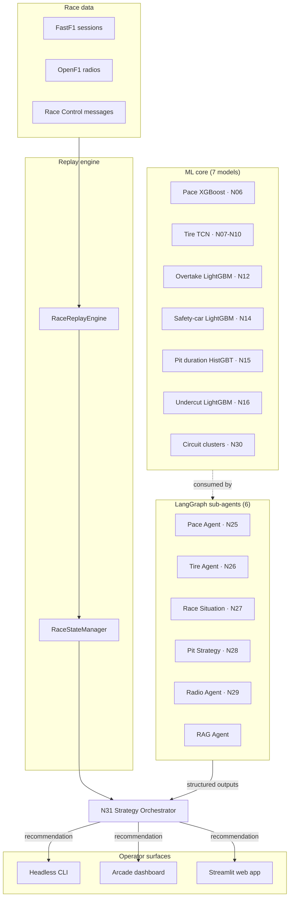

---
hide:
  - navigation
  - toc
---

<div class="stratlab-hero" markdown>
  <span class="eyebrow">F1 StratLab · Documentation</span>
  # AI for real-time F1 race strategy
  <p>Open-source multi-agent system that fuses seven machine-learning models, six LangGraph sub-agents and one strategy orchestrator into a single Formula 1 strategy recommender. Built end-to-end as a Final-Degree Project on Intelligent Systems Engineering, shipped under Apache-2.0.</p>
  <div class="stratlab-hero-cta">
    <a class="md-button" href="getting-started/">Get started</a>
    <a class="md-button md-button--secondary" href="architecture/">Architecture tour</a>
    <a class="md-button md-button--secondary" href="https://github.com/VforVitorio/F1-StratLab">GitHub</a>
  </div>
</div>

## What lives here

This site is the canonical technical reference for the F1 StratLab codebase. It is hand-curated and complements two sibling resources: the public landing at [f1stratlab.com](https://f1stratlab.com/) tells the project story for non-technical visitors, and the auto-generated [DeepWiki](https://deepwiki.com/VforVitorio/F1-StratLab) gives a notebook-per-notebook tour of the source tree. The pages you are reading focus on the narratives those two cannot: how the layers connect, why the contracts look the way they do, and what to do when something breaks.

## The system at a glance



Three layers carry the system from raw telemetry to a strategy call:

<div class="stratlab-stack-grid" markdown>
  <div class="stratlab-stack-card" markdown>
  <span class="stratlab-stack-eyebrow">Layer 01</span>
  ### Machine-learning core
  Seven specialised models cover lap-time prediction, tire degradation, overtake probability, safety-car detection, pit-stop duration, undercut feasibility and circuit clustering. All shipped as serialised artefacts under `data/models/` and version-pinned with the release.
  </div>
  <div class="stratlab-stack-card" markdown>
  <span class="stratlab-stack-eyebrow">Layer 02</span>
  ### Multi-agent reasoning
  Six LangGraph ReAct agents (Pace, Tire, Race Situation, Pit, Radio, RAG) call those models and exchange structured outputs with the N31 Strategy Orchestrator. The orchestrator runs a Monte-Carlo simulation, scores candidate strategies and synthesises the final recommendation with an LLM.
  </div>
  <div class="stratlab-stack-card" markdown>
  <span class="stratlab-stack-eyebrow">Layer 03</span>
  ### Operator surfaces
  Three independent UIs consume the orchestrator: the headless CLI for batch races, the three-window Arcade dashboard for live racing, and the Streamlit web app for race analysis and natural-language Q&A.
  </div>
</div>

## Meet the agents

Six specialists feed the orchestrator. Each one wraps a single ML model behind a LangGraph ReAct loop and emits a strictly-typed payload the orchestrator can fuse.

<div class="stratlab-agent-grid" markdown>
  <div class="stratlab-agent-card" markdown>
  <span class="stratlab-agent-tag">Specialist</span>
  ### Pace Agent
  Predicts the next lap delta given current stint state and tire age. Feeds the orchestrator with the expected lap time for the upcoming lap.
  **Model**: XGBoost delta lap-time (N06) · MAE 0.39 s on 2025 holdout.
  [Reference](agents-api-reference.md)
  </div>
  <div class="stratlab-agent-card" markdown>
  <span class="stratlab-agent-tag">Specialist</span>
  ### Tire Agent
  Forecasts compound degradation curves with uncertainty bands. Flags the cliff window where the current set stops being competitive.
  **Model**: TireDegTCN (N07-N10) · per-compound fine-tuned with MC Dropout.
  [Reference](agents-api-reference.md)
  </div>
  <div class="stratlab-agent-card" markdown>
  <span class="stratlab-agent-tag">Specialist</span>
  ### Race Situation Agent
  Reads the field around the target driver and estimates overtake / defence probabilities for the rivals ahead and behind.
  **Models**: Overtake LightGBM (N12) · Safety-car soft prior (N14).
  [Reference](agents-api-reference.md)
  </div>
  <div class="stratlab-agent-card" markdown>
  <span class="stratlab-agent-tag">Specialist</span>
  ### Pit Strategy Agent
  Scores undercut and overcut feasibility against the current rivals and estimates the physical pit-stop time.
  **Models**: Undercut LightGBM (N16) · Pit duration HistGBT (N15).
  [Reference](agents-api-reference.md)
  </div>
  <div class="stratlab-agent-card" markdown>
  <span class="stratlab-agent-tag">Specialist</span>
  ### Radio Agent
  Parses the latest team radio and race-control messages into structured intents (`PIT_REQUEST`, `BOX_BOX`, yellow-flag signals, complaint flags).
  **Models**: NLP pipeline (N17-N24) · SetFit intents + BERT NER + RoBERTa sentiment.
  [Reference](agents-api-reference.md)
  </div>
  <div class="stratlab-agent-card" markdown>
  <span class="stratlab-agent-tag">Knowledge</span>
  ### RAG Agent
  Retrieves relevant rule-book passages, historical reference races and prior-art tactics. Backs the orchestrator's free-text rationale.
  **Backend**: Qdrant vector store · curated F1 corpus.
  [Reference](agents-api-reference.md)
  </div>
</div>

## Get started in three steps

<div class="stratlab-step-grid" markdown>
  <div class="stratlab-step-card" markdown>
  <span class="stratlab-step-eyebrow">Step 01</span>
  ### Install the wheel
  Pull the latest release straight into your current environment. No clone, no build step.
  ```bash
  uv pip install https://github.com/VforVitorio/F1-StratLab/releases/download/v1.1.0/f1_strat_manager-1.1.0-py3-none-any.whl
  ```
  </div>
  <div class="stratlab-step-card" markdown>
  <span class="stratlab-step-eyebrow">Step 02</span>
  ### Boot an entry point
  Four console scripts ship with the wheel. The interactive launcher is the easiest first stop.
  ```bash
  f1-strat       # interactive launcher
  f1-sim         # headless CLI simulation
  f1-arcade      # three-window arcade UI
  f1-streamlit   # Streamlit dashboards
  ```
  </div>
  <div class="stratlab-step-card" markdown>
  <span class="stratlab-step-eyebrow">Step 03</span>
  ### Pick your path
  Read the architecture tour for the big picture, then drill into the surface that matches your goal.
  ```bash
  open https://docs.f1stratlab.com/architecture/
  open https://docs.f1stratlab.com/arcade/quick-start/
  open https://docs.f1stratlab.com/agents-api-reference/
  ```
  </div>
</div>

## By the numbers

<div class="stratlab-stat-grid" markdown>
  <div class="stratlab-stat" markdown>
  <span class="stratlab-stat-number">7</span>
  <span class="stratlab-stat-label">ML models shipped</span>
  </div>
  <div class="stratlab-stat" markdown>
  <span class="stratlab-stat-number">6</span>
  <span class="stratlab-stat-label">LangGraph sub-agents</span>
  </div>
  <div class="stratlab-stat" markdown>
  <span class="stratlab-stat-number">31</span>
  <span class="stratlab-stat-label">Production notebooks · N06-N34</span>
  </div>
  <div class="stratlab-stat" markdown>
  <span class="stratlab-stat-number">21 247</span>
  <span class="stratlab-stat-label">Laps in the 2025 holdout</span>
  </div>
  <div class="stratlab-stat" markdown>
  <span class="stratlab-stat-number">15</span>
  <span class="stratlab-stat-label">Ground-truth queries · 3 RAG configs</span>
  </div>
  <div class="stratlab-stat" markdown>
  <span class="stratlab-stat-number">1</span>
  <span class="stratlab-stat-label">Thesis · Final-Degree Project</span>
  </div>
</div>

## Companion resources

<div class="stratlab-grid" markdown>

<div class="stratlab-card" markdown>
### Landing site
The public-facing site with the hero animation, agent gallery and project narrative aimed at non-technical visitors.

[Open f1stratlab.com](https://f1stratlab.com/)
</div>

<div class="stratlab-card" markdown>
### DeepWiki
Auto-generated codebase wiki with deep-linked summaries of every file. Best for ad-hoc "where does X live" questions.

[Open DeepWiki](https://deepwiki.com/VforVitorio/F1-StratLab)
</div>

<div class="stratlab-card" markdown>
### Releases
Every published wheel and source distribution, plus the release notes for v1.0.0 onwards and the changelog seeded retroactively to v0.6.

[Open releases](https://github.com/VforVitorio/F1-StratLab/releases)
</div>

</div>

<div class="stratlab-callout" markdown>
  <span class="stratlab-callout-eyebrow">DeepWiki integration</span>
  ### Per-notebook deep-dives live on DeepWiki
  This site carries the curated narratives — architecture, agent contracts, deployment, thesis results. For a line-by-line view of any notebook or `src/` module, jump to the [F1 StratLab DeepWiki](https://deepwiki.com/VforVitorio/F1-StratLab). It is regenerated on every push to `main` and stays in lock-step with the codebase.
</div>

## Project status

| Component | Version | Status |
|---|---|---|
| Multi-agent orchestrator (N31) | v1.0.0 | shipped |
| Arcade three-window MVP | v1.0.0 | shipped |
| Benchmark suite (Chapter 5) | v1.1.0 | shipped |
| Release automation (`release-please`) | v1.1.0 | shipped |

The current focus is documentation polish for the thesis defence; see the [project changelog](https://github.com/VforVitorio/F1-StratLab/blob/main/CHANGELOG.md) for the full history.
