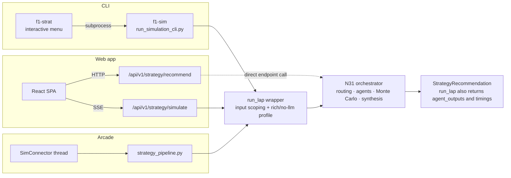

# Strategy Pipeline, the shared engine

`src/strategy/inference/engine.py::run_lap` is the shared N31 engine wrapper for `f1-sim`, Arcade and backend race simulation. The single-lap `/recommend` endpoint calls `run_strategy_orchestrator_from_state` directly, outside that wrapper. This page covers both call paths, the engine profiles and the Arcade delegate.

## Call paths



`/api/v1/strategy/simulate` and the CLI/Arcade paths use `run_lap`. The single-lap `/api/v1/strategy/recommend` handler instead builds the race state and calls `run_strategy_orchestrator_from_state` directly. Both use the N31 orchestration logic, but `/recommend` bypasses the engine wrapper and its profile selection.

The wrapper callers share GP scoping, caller-owned decision memory and the `rich` or `no-llm` profile. The direct `/recommend` path has its own request-to-`RaceState` conversion and is stateless. Outputs can differ because the wrapper carries race memory and the profiles run different agents.

```
src/strategy/inference/engine.py
    run_lap(race_state, laps_df, lap_state=None, *, profile="rich",
            return_agent_outputs=True, memory=None)
        -> tuple[StrategyRecommendation, dict | None, dict[str, float]]
```

- `StrategyRecommendation`, the synthesised decision (14 fields). What the CLI and the web app consume.
- `agent_outputs`, the raw per-sub-agent dataclasses, keyed `pace_out`, `tire_out`, `situation_out`, `radio_out`, `pit_out`, `regulation_context`, `rag`, `active`, `guardrail_reason`. What the arcade dashboard renders its cards and charts from.
- stage timings, per-stage seconds, for the surfaces that show them.

The sub-agents are imported through their public `*_from_state` entry points; the output dataclasses come from `src/agents/strategy_orchestrator.py`. Nothing about them is engine-specific.

## Profiles

| profile | what runs | use it for |
|---|---|---|
| `rich` | always-on agents, routed N28/N30 calls and LLM synthesis | the default; `run_lap` supplies its caller-owned decision memory |
| `no-llm` | skips N28, N30 and LLM synthesis; runs Monte Carlo with the conservative pit prior and applies deterministic guardrails | runs that must not make LLM calls |

Both profiles reuse orchestrator functions, but they do not promise byte-for-byte output parity. `tests/engine/test_engine_threads_every_argument.py` checks argument forwarding, not output equality. The engine's `memory_block` also differs from the stateless `/recommend` path.

## The arcade delegates

`src/arcade/strategy_pipeline.py::run_strategy_pipeline` keeps its public signature so `src/arcade/strategy.py` and the dashboard formatters are untouched. It selects the engine profile from the Arcade mode, then delegates:

```python
profile = "no-llm" if no_llm else "rich"
rec, agent_outputs, _timings = run_lap(
    race_state, laps_df, lap_state, profile=profile, memory=memory
)
return rec, agent_outputs
```

`memory` is the `DecisionMemory` the surface owns. It arrived after this page
was first written and both snippets above used to omit it, which made the
delegate look thinner than it is.


The arcade needs the raw outputs and the CLI does not, but that is a difference in **consumption**, not in pipeline. `run_lap` returns both and each surface takes what it renders.

## Why this replaced a duplicate

This module was a body-copy of the orchestrator, kept in sync by a manual ritual: open both files side by side and transcribe every edit by hand. That ritual was the bug. A copy kept in sync by discipline drifts the first time someone edits one file and not the other, and it did: the two files drifted, and #166 is the crash that followed.

The lesson generalises beyond the arcade, and the strategy engine relearned it the hard way. `src/simulation/race_state_manager.py` had already solved a pile of race-data problems correctly (NaN never becomes a searchable number, gaps come from the elapsed-time column, retired cars fall out on their own). A second implementation was later written alongside it for the API path, and it reproduced every one of those bugs from scratch, silently, for months. Two implementations of the same idea do not stay equal because someone intends them to.

**Before writing a second path that shapes race data, check whether a clean one already exists.** If it does, call it.

## SimConnector threading

The arcade strategy driver is `src/arcade/strategy.py::SimConnector`. It is a plain Python class, not a Qt object, spawned as a `threading.Thread` from `F1ArcadeView._init_strategy_layer`.

- Owns a `StrategyState` dataclass caching the latest `LapDecision`, the per-agent outputs and playback metadata, behind a `threading.Lock`.
- Owns the background thread that iterates `RaceReplayEngine.replay()` and calls `run_strategy_pipeline(race_state, laps_df, lap_state, memory=self._memory)` per lap. Passing `lap_state` is not optional: with it `None` the Monte Carlo falls back to the legacy seconds path and the projection layer is silently amputated, which is the one call shape these pages used to show.
- Emits `StartEventDTO` once on the first frame, then `LapDecisionDTO` per lap.

## Why not SSE from the backend

The arcade used to subscribe to `GET /api/v1/strategy/simulate/stream`. Phase 3.5 replaced it with the direct in-process loop:

- No extra process. Strategy mode no longer needs `uvicorn` running first.
- No SSE client. The arcade's consumer was a hand-rolled parser over `httpx.stream` with its own reconnect logic. A thread is simpler.
- Standalone. The arcade ships without a FastAPI dependency.

The backend SSE endpoint is still live and smoke-tested; the arcade just does not consume it.

## Smoke test

```bash
# CLI path
f1-sim Melbourne VER "Red Bull Racing" --no-llm

# Arcade path
python -m src.arcade.main --viewer --year 2025 --round 3 --driver VER --team "Red Bull Racing" --strategy
```

Both should reach lap 2 without tracebacks.
