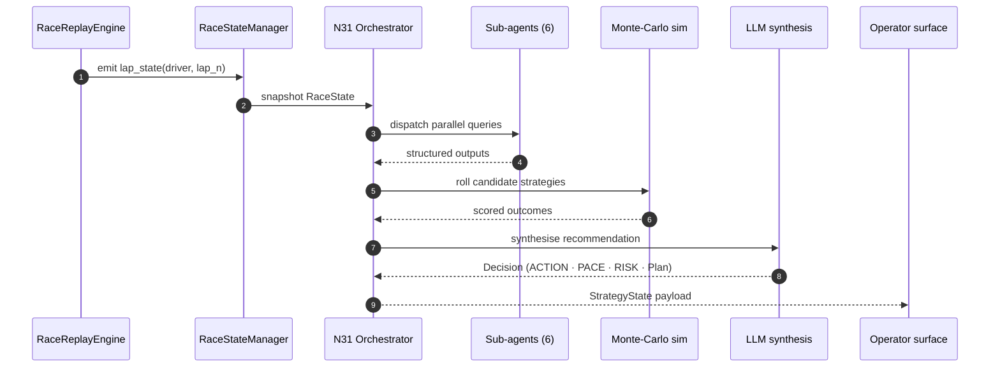

# How F1 StratLab is wired

> An end-to-end tour of the codebase: how a single lap-tick travels from the replay engine through the six sub-agents, into the N31 orchestrator and out to the operator surfaces. Use this page as the entry point, then drill into the deeper references below.

## One lap, end to end

The diagram below traces the lifecycle of a single lap. Every component is reified in `src/` — the names match the production modules so you can grep your way from this page into the source.

The same loop runs in three places: the CLI consumes it in batch, the Arcade renders it in a PySide6 dashboard, and the Streamlit app surfaces it inside a chat tab.

## Where to go next

Six layers, six pages — each linked from the agent graph and from this page.

- **[Multi-agent system](#/multi-agent)** — N25–N31 architecture: agents, MoE routing, Monte-Carlo simulation, LLM synthesis.
- **[Simulation engine](#/simulation)** — `RaceReplayEngine`, `RaceStateManager`, the `lap_state` schema every layer agrees on.
- **[Agents API reference](#/agents-api)** — per-agent input / output schemas, model artefacts and entry-point signatures.
- **[Backend API](#/backend-api)** — FastAPI routers, the SSE simulation endpoint, the contract Streamlit and the Arcade speak.
- **[Streamlit frontend](#/streamlit)** — tab-by-tab walkthrough of the Streamlit app.
- **[Arcade dashboard](#/arcade-quick-start)** — three independent windows coordinated by a single Python process.

> **Looking for a specific file?** The narratives on this site stop at the contract level. For per-file deep-dives — every function in `src/agents/`, every notebook from N06 to N34, every helper in `src/arcade/` — jump to the [F1 StratLab DeepWiki](https://deepwiki.com/VforVitorio/F1-StratLab). It is regenerated on every push to `main`.

## Key data contracts

Three structures cross every boundary in the system. If you remember nothing else, remember these.

### `lap_state`

The atomic payload the simulation engine emits per driver per lap. It carries the bare-minimum slice of telemetry the agents need: current lap number, compound and tire age, current and previous lap times, gap to leader and rivals, sector deltas, pit-window flag, and the active race-control state. Every downstream agent treats `lap_state` as immutable; mutations happen in the orchestrator's state machine, not inside the agents.

### `RaceState`

The cumulative session view assembled by `RaceStateManager` from successive `lap_state` ticks. It holds the entire field's stint history, the pit-stop log, the safety-car timeline, and the per-driver tire compound roster. The orchestrator snapshots `RaceState` before each decision so every sub-agent sees the same frozen world, regardless of how fast they each respond.

### `StrategyState`

The structured output the orchestrator emits per decision tick. Fourteen fields are frozen by schema (action, target lap, target compound, expected delta, pace mode, risk level, plan summary, rationale, confidence, sub-agent attributions, scenario scores, and metadata flags); the narrative richness lives inside the LLM-synthesised `Plan` and `Rationale` blocks. `StrategyState` is what the CLI prints, the Arcade renders and the Streamlit chat surfaces.

## How the pieces ship

Three independent release tracks ship the system so that consumers can pick the surface that fits their workflow:

- **R1 — CLI wheel.** `uv tool install` straight from the GitHub release. Headless, batchable, no GPU needed for the inference path.
- **R2 — Arcade.** The three-window PySide6 + pyglet experience. Same wheel, but the `f1-arcade` entry point boots the GUI and spawns the strategy subprocess locally.
- **R3 — Backend + Streamlit.** The FastAPI server (SSE simulator, MCP tools) plus the Streamlit chat / race-analysis frontend. Docker-compose recipe ships the whole stack.

See [Setup and deployment](#/setup) for the full install matrix per surface and platform.
