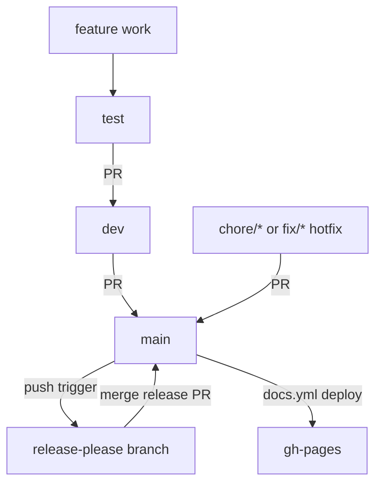
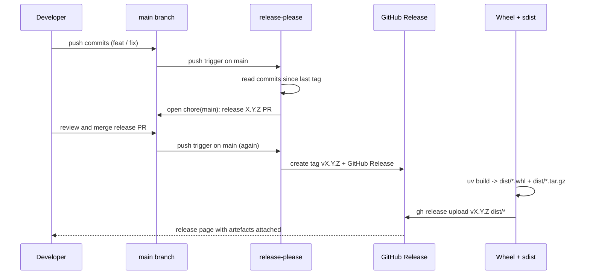

# CI/CD pipeline

Single source of truth for how F1 StratLab is built, tested, released and deployed. Read this once and you will know how a commit becomes a published release and the live docs site.

The pipeline is split across three GitHub Actions workflows, a release-please bot for versioning, Dependabot for dependency hygiene, and a few repository-level toggles that quietly make everything work.

## Branching strategy

The repository uses a layered branching model. Feature work lands on `test` first, gets promoted to `dev` once it stabilises, and only reaches `main` when it is release-ready.



| Branch | Purpose | Who pushes |
|---|---|---|
| `main` | Production / release branch | Merge commits from PRs only |
| `dev` | Integration branch | Merge commits from PRs originating on `test` |
| `test` | Active development branch | Developers, frequently |
| `legacy_version` | Historical snapshot | Nobody. Frozen |
| `gh-pages` | Build output of `mkdocs gh-deploy` | The `docs.yml` workflow |
| `release-please--...` | Auto-managed by the release-please bot | The release-please GitHub Action |

The default flow is `feature → test → dev → main`. Hotfixes go via a `chore/...` or `fix/...` branch straight to `main`.

## CI workflows

Three workflows live under `.github/workflows/`. They run independently, on different triggers, and have different blast radii.

### `.github/workflows/ci.yml`

Triggered on push to `main`, `dev`, `feat/**`, `fix/**`, and on pull request targeting `main` or `dev`. Three jobs run in parallel on `ubuntu-latest` with Python 3.12:

- `test` — `uv sync --all-extras` followed by `uv run pytest -v`.
- `lint` — `uv run ruff check .` and `uv run ruff format --check .`.
- `typecheck` — `uv run mypy src/rag/`. Narrow scope: only production-ready typed modules are checked.

The jobs are deliberately decoupled. A red `lint` does not stop `test` from running.

### `.github/workflows/release-please.yml`

Triggered on push to `main`. Two jobs:

1. **release-please** — runs `googleapis/release-please-action@v4`. Reads commits since the last tag and, if any commit uses a bumpable prefix (`feat:`, `fix:`, `feat!:`), opens or updates a `chore(main): release X.Y.Z` PR on the bot branch. When that PR is merged, the same job creates the tag and the GitHub Release.
2. **publish-wheel** — gated by `if: needs.release-please.outputs.release_created == 'true'`. Runs `uv build` to produce a wheel and an sdist, then `gh release upload` to attach both artefacts.

```yaml
jobs:
  release-please:
    outputs:
      release_created: ${{ steps.release.outputs.release_created }}
      tag_name: ${{ steps.release.outputs.tag_name }}
  publish-wheel:
    needs: release-please
    if: ${{ needs.release-please.outputs.release_created == 'true' }}
```

### `.github/workflows/docs.yml`

Triggered on push to `main` only when one of the following paths changes: `docs/**`, `documents/images/**`, `mkdocs.yml`, `requirements-docs.txt`, or the workflow file itself.

A single job runs `actions/checkout@v4 → actions/setup-python@v5 (3.12) → pip install -r requirements-docs.txt → mkdocs gh-deploy --force --clean --verbose`.

Concurrency is scoped to `docs-${{ github.ref }}` with `cancel-in-progress: true`, so two consecutive pushes to `main` will not stack two deploys.

See [docs maintenance](#/docs-maintenance) for the site-specific details.

## The release-please pipeline

A release goes through nine steps from the first commit to the published wheel.



End users can then install directly from the release URL:

```bash
uv pip install \
  https://github.com/VforVitorio/F1-StratLab/releases/download/vX.Y.Z/f1_strat_manager-X.Y.Z-py3-none-any.whl
```

Release cadence is event-driven, not calendar-driven. Releases happen whenever a bumpable commit lands on `main`.

## Dependabot policy

| Ecosystem | Cadence | Open PR cap | Ignored |
|---|---|---|---|
| `pip` | weekly, Monday 08:00 Europe/Madrid | 5 | `torch`, `torchvision`, `transformers` (major bumps) |
| `github-actions` | monthly | 3 | none |

The ignore list exists for hard technical reasons:

- `torch` and `torchvision` are routed through CUDA-specific indexes. Any automatic bump would invalidate the `cu128` wheel routing.
- `transformers` is pinned because the production model artefacts under `data/models/nlp/` are saved with tokeniser and config layouts that are not forward-compatible across major versions.

## Documentation deployment

The docs site at [docs.f1stratlab.com](https://docs.f1stratlab.com/) is built from `docs/` with `mkdocs-material` and deployed to the `gh-pages` branch.

### The Pages source-mode trap

GitHub Pages can read its content either from a workflow artefact or from a branch. F1 StratLab uses the branch mode pointing at `gh-pages` because `mkdocs gh-deploy` pushes a branch, not an artefact. If a future docs deploy succeeds in CI but the live site shows stale content, check this setting first:

```bash
gh api -X PUT repos/VforVitorio/F1-StratLab/pages \
  -F build_type=legacy \
  -f 'source[branch]=gh-pages' \
  -f 'source[path]=/'
```

## Repository settings that make this work

- **Allow GitHub Actions to create and approve pull requests.** Required for release-please to open release PRs.
- **Allow auto-merge on the repository.** Required for `gh pr merge --auto` to be a valid option.
- **GitHub Pages source = `gh-pages` branch.** Required for the docs site to publish.
- **Branch protection on `main` and `dev`.** Required to ensure CI checks pass before merge.
- **`RELEASE_PLEASE_TOKEN` repository secret.** A fine-grained PAT with `contents: write` and `pull-requests: write`.

## Contributor checklist

Before opening a PR, run the same three commands CI runs:

```bash
uv run pytest -v
uv run ruff check . && uv run ruff format --check .
uv run mypy src/rag/
```

Once the PR is open and green, queue it for auto-merge:

```bash
gh pr create --base dev --title "feat(arcade): live telemetry chart" --body "..."
gh pr merge <num> --auto --squash
```

## Failure modes and recovery

| Symptom | Likely cause | Command to fix |
|---|---|---|
| release-please PR not opened after `feat:` merge | Workflow permissions too low | `gh api -X PUT repos/.../actions/permissions/workflow -F default_workflow_permissions=write` |
| Wheel not attached to a freshly cut release | `publish-wheel` did not run | `gh workflow run release-please.yml --ref main` |
| Docs CI green but site shows stale content | Pages source set to `workflow` instead of `gh-pages` | `gh api -X PUT repos/.../pages -F build_type=legacy -f 'source[branch]=gh-pages'` |
| Dependabot bumped `torch` and broke CUDA wheel routing | Ignore rule missing from `dependabot.yml` | Close the PR and re-add the ignore entry |
| Need to roll back a bad release | Delete the tag and the Release | `gh release delete vX.Y.Z --yes --cleanup-tag` |
