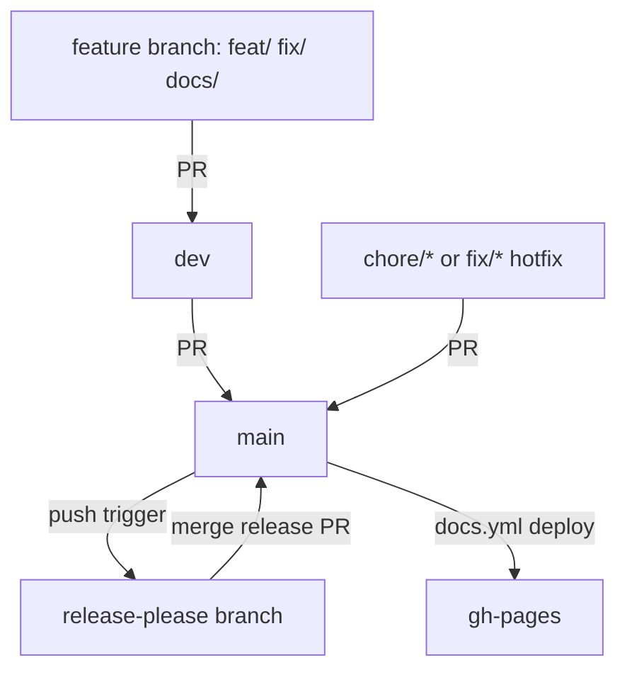
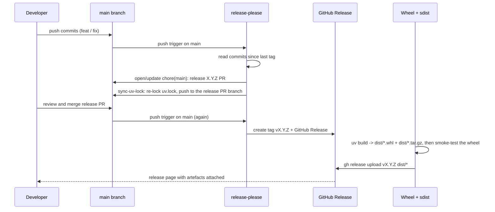

# CI/CD pipeline

Single source of truth for how F1 StratLab is built, tested, released and deployed. Reading it once explains how a commit becomes a published release and the live docs site.

The pipeline is split across ten GitHub Actions workflows, a release-please bot for versioning, Dependabot for dependency hygiene, and a few repository-level toggles that make everything work. The pull-request gate is deliberately small and fast; the scheduled workflows carry the expensive and external checks.

## Branching strategy

Three long-lived branches, in increasing order of stability. Every change branches off (`feat/…`, `fix/…`, `docs/…`) and opens a **pull request directly against `dev`**: `test` is a personal, day-to-day branch that is not part of the enforced PR chain (no PRs are opened against it in practice; `git log` shows feature branches merging straight into `dev`). `dev` is periodically promoted to `main` via its own PR, and `main` is release-only.


```mermaid
graph TD
    A[feature branch: feat/ fix/ docs/] -->|PR| D[dev]
    D -->|PR| M[main]
    H[chore/* or fix/* hotfix] -->|PR| M
    M -->|push trigger| RP[release-please branch]
    RP -->|merge release PR| M
    M -->|docs.yml deploy| GP[gh-pages]
```

| Branch | Purpose | Who pushes |
|---|---|---|
| `main` | Production / release branch | Merge commits from PRs only (from `dev`, or a hotfix branch) |
| `dev` | Integration branch | Merge commits from `feat/`/`fix/`/`docs/` PRs |
| `test` | Personal day-to-day branch | Direct commits; not part of the automated PR promotion chain |
| `legacy_version` | Historical snapshot | Nobody. Frozen |
| `gh-pages` | Published output of the `docs.yml` React SPA deploy | The `docs.yml` workflow |
| `release-please--...` | Auto-managed by the release-please bot | The release-please GitHub Action |

The default flow is `feature branch → dev → main`. Hotfixes go via a `chore/...` or `fix/...` branch straight to `main`. See [CONTRIBUTING.md](https://github.com/VforVitorio/F1-StratLab/blob/main/CONTRIBUTING.md) for the canonical statement of this rule.

## CI workflows

Eight workflows live under `.github/workflows/`. They run independently, on different triggers, and have different blast radii. The three below do the heavy lifting; the rest are listed after them.

| Workflow | What it is for |
|---|---|
| `ci.yml` | test / lint / typecheck / pip-audit, plus the PITWALL UI job |
| `release-please.yml` | version bumps, the CHANGELOG and the release PR |
| `docs.yml` | builds and publishes this site |
| `nightly-tests.yml` | full data-capable pytest suite, four workers and coverage |
| `network-contracts.yml` | scheduled external Hugging Face publication contract |
| `codeql.yml` | SAST over the project's own code |
| `osv-scanner.yml` | cross-ecosystem vulnerability scan |
| `gitleaks.yml` | secret scanning over the repo and its diffs |
| `labeler.yml` | applies `area:` labels from the changed paths |
| `auto-update-prs.yml` | rebases low-touch PRs when `dev` moves |

### `.github/workflows/ci.yml`

Triggered on push to `main`, `dev`, and `test`, and on pull request targeting `main` or `dev`. Feature branches use the pull-request trigger, so the same commit does not pay for a second push run. Five jobs run in parallel on `ubuntu-latest`:

- `test`, path-filter gated on source, scripts, tests, data contracts, documentation, dependency, and workflow paths (via `dorny/paths-filter@v4`). When triggered: `uv sync --all-extras --frozen` (Python 3.12), a collected-count floor check, then `uv run pytest -v -n 4 --dist=loadfile -m "not data and not slow and not network" --cov=src --cov-report=term-missing`. The fast gate leaves model-backed measurements and external contracts to scheduled workflows.
- `lint`, always runs, no `uv sync` needed. `uvx ruff@$RUFF_VERSION check .` and `uvx ruff@$RUFF_VERSION format --check .` as ephemeral tools, so it skips installing the whole ML/torch stack just to lint style. The version comes from the `RUFF_VERSION` variable at the top of the workflow, pinned because an unpinned `uvx ruff` resolves the newest release at run time and can turn every branch red without a commit.
- `typecheck`, same path-filter gate as `test`. `uv sync --extra dev --frozen` then `uv run mypy src/rag/`. Narrow scope: only production-ready typed modules are checked. Caches `.mypy_cache/` keyed on `pyproject.toml` + `src/rag/**`.
- `pip-audit`, always runs, no path filter. Exports the locked dependency set with `uv export --frozen --no-emit-project --all-extras --no-hashes` and runs the pinned `pip-audit` tool against it for same-day CVE alerts, independent of whether the diff touches `uv.lock`. Advisory (`continue-on-error: true`) while baselining.

The jobs are deliberately decoupled. A red `lint` does not stop `test` from running. `test` and `typecheck` both checkout with `fetch-depth: 0` **before** the paths-filter step, because the filter falls back to `git diff` on `push` events and needs full history.

### Test tiers

The parent pytest configuration registers seven explicit markers:

| Marker | Meaning | Default PR gate |
|---|---|---|
| `unit` | pure hermetic logic | included |
| `contract` | API, schema, or fixture-backed protocol | included |
| `data` | HF dataset or model artefacts | excluded, nightly or local |
| `gpu` | CUDA-dependent work | excluded, local hardware |
| `llm` | live or stubbed LLM backend | excluded until a hermetic stub exists |
| `slow` | expensive measurement or real-path test | excluded, nightly or focused |
| `network` | external service or public artefact | excluded, scheduled workflow |

Run the fast gate locally with:

```bash
uv run pytest -n 4 --dist=loadfile -m "not data and not slow and not network" --cov=src
```

Run the complete local suite when changing test boundaries or preparing a
release:

```bash
uv run pytest -n 4 --dist=loadfile --cov=src
```

The `-ra` pytest setting keeps skipped and deselected tests visible. A skipped
data test means that the required artefact is absent; it is not a passing
measurement.

### Scheduled test workflows

`nightly-tests.yml` runs the full parent suite from a recursive checkout with
four xdist workers and coverage, Monday to Friday at 03:00 UTC or on demand.
`network-contracts.yml` runs the Hugging Face publication contract every
Monday at 03:30 UTC or on demand. Keeping these checks outside the PR gate
shortens reviews without deleting the evidence-producing tests.

### `src/telemetry/.github/workflows/ci.yml`

The telemetry submodule has its own CI in the `F1_Telemetry_Manager` repository.
It uses `astral-sh/setup-uv@v7` with Python 3.11, pins uv to `0.9.13`, and
caches the submodule `uv.lock`. The lint and test jobs install only the
lightweight `ci` dependency group with `uv sync --frozen --only-group ci --no-install-project`, then run Ruff and pytest through `uv run --frozen --no-sync`. The full runtime is reserved for Docker, where the backend image
syncs the project dependencies from the same lockfile. The parent CI checks the
gitlink but does not replace the submodule workflow. Feature branches trigger
the submodule workflows through pull requests only; pushes are limited to
`main`, avoiding duplicate push and PR runs. The current hermetic submodule
suite is 107 passed and 4 skipped.

### `.github/workflows/release-please.yml`

Triggered on push to `main`. Three jobs:

1. **release-please**, runs `googleapis/release-please-action@v5` with the built-in `GITHUB_TOKEN` (not a PAT: `main` carries no required status checks on the release PR, so a PAT buys nothing here). Reads commits since the last tag and, if any commit uses a bumpable prefix (`feat:`, `fix:`, `feat!:`), opens or updates a `chore(main): release X.Y.Z` PR on the bot branch. When that PR is merged, the same job creates the tag and the GitHub Release.
2. **publish-wheel**, gated by `if: needs.release-please.outputs.release_created == 'true'`. Checks out with `submodules: recursive` (so `src/telemetry`, the FastAPI backend, is baked into the wheel, which a prior release shipped without), runs `uv build` to produce a wheel and an sdist, then **smoke-tests the wheel** before uploading: installs it with `--no-deps` into a scratch venv and asserts all five console scripts (`f1-strat`, `f1-sim`, `f1-arcade`, `f1-webapp`, `f1-eval`) resolve and their backing modules shipped. Only then does `gh release upload` attach the wheel and sdist.
3. **sync-uv-lock**, gated by `if: needs.release-please.outputs.prs_created == 'true'`, so it runs every time release-please opens or updates the release PR (not only on merge). release-please bumps `pyproject.toml`'s version but never `uv.lock`'s own root `version` field, which would otherwise leave the next `uv sync --frozen` CI run red on the mismatch. This job checks out the release PR's branch, runs `uv lock`, and commits the re-locked `uv.lock` back onto that branch if it changed.

```yaml
jobs:
  release-please:
    outputs:
      release_created: ${{ steps.release.outputs.release_created }}
      tag_name: ${{ steps.release.outputs.tag_name }}
      prs_created: ${{ steps.release.outputs.prs_created }}
      pr: ${{ steps.release.outputs.pr }}
  publish-wheel:
    needs: release-please
    if: ${{ needs.release-please.outputs.release_created == 'true' }}
  sync-uv-lock:
    needs: release-please
    if: ${{ needs.release-please.outputs.prs_created == 'true' }}
```

### `.github/workflows/docs.yml`

Triggered on push to `main` only when one of the following paths changes: `docs/**`, `scripts/prerender_docs.mjs`, or the workflow file itself.

A single job stages `docs/` into `_site/`, installs `marked` via `npm install`, then runs `node scripts/prerender_docs.mjs docs _site` to render each `docs/pages/*.md` into a crawlable `/<slug>/index.html` and generate `sitemap.xml`, `llms-full.txt`, and `404.html`. After injecting the release version from `pyproject.toml` (replacing the `__DOCS_VERSION__` placeholder), it publishes `_site` to the `gh-pages` branch via `peaceiris/actions-gh-pages@v4`.

Concurrency is scoped to `docs-${{ github.ref }}` with `cancel-in-progress: true`, so two consecutive pushes to `main` will not stack two deploys.

See [docs maintenance](#/docs-maintenance) for the site-specific details.

## The release-please pipeline

A release goes through ten steps from the first commit to the published wheel.


```mermaid
sequenceDiagram
    participant Dev as Developer
    participant Repo as main branch
    participant Bot as release-please
    participant Rel as GitHub Release
    participant Art as Wheel + sdist

    Dev->>Repo: push commits (feat / fix)
    Repo->>Bot: push trigger on main
    Bot->>Bot: read commits since last tag
    Bot->>Repo: open/update chore(main): release X.Y.Z PR
    Bot->>Repo: sync-uv-lock: re-lock uv.lock, push to the release PR branch
    Dev->>Repo: review and merge release PR
    Repo->>Bot: push trigger on main (again)
    Bot->>Rel: create tag vX.Y.Z + GitHub Release
    Art->>Art: uv build -> dist/*.whl + dist/*.tar.gz, then smoke-test the wheel
    Art->>Rel: gh release upload vX.Y.Z dist/*
    Rel-->>Dev: release page with artefacts attached
```

End users can then install directly from the release URL:

```bash
uv pip install \
  https://github.com/VforVitorio/F1-StratLab/releases/download/vX.Y.Z/f1_strat_manager-X.Y.Z-py3-none-any.whl
```

Release cadence is event-driven, not calendar-driven. Releases happen whenever a bumpable commit lands on `main`.

## Dependabot policy

| Ecosystem | Cadence | Open PR cap | Ignored |
|---|---|---|---|
| `pip` | weekly, Monday 08:00 Europe/Madrid | 5 | `torch`, `torchvision` (any bump); `transformers`, `numpy`, `pandas`, `scikit-learn`, `lightgbm`, `xgboost` (major bumps only) |
| `github-actions` | monthly | 3 | none |

The ignore list exists for hard technical reasons:

- `torch` and `torchvision` are routed through CUDA-specific indexes (`[tool.uv.sources]`). Any automatic bump would invalidate the `cu128` wheel routing on Windows/Linux.
- `transformers` major bumps are blocked because the production model artefacts under `data/models/nlp/` are saved with tokeniser and config layouts that are not forward-compatible across major versions; bump only alongside re-training the affected notebooks (N17-N24).
- `numpy`, `pandas`, `scikit-learn`, `lightgbm`, `xgboost` block major bumps only (minor/patch flow through normally): their `2.x`/`3.x` releases have historically removed APIs the project relies on (e.g. `numpy` 2.0 dropped `np.bool_` aliases, `pandas` 3.0 removes several `DataFrame` methods). `tests/infra/test_dep_imports.py` exercises the relied-on surface so silent breakage is caught even on allowed bumps.

## Documentation deployment

The docs site at [docs.f1stratlab.com](https://docs.f1stratlab.com/) is a React SPA (plain `React.createElement`, no build step) served from the `docs/` directory and deployed to the `gh-pages` branch by `docs.yml`.

### The Pages source-mode trap

GitHub Pages can read its content either from a workflow artefact or from a branch. F1 StratLab uses the branch mode pointing at `gh-pages` because `peaceiris/actions-gh-pages` pushes to that branch directly. If a future docs deploy succeeds in CI but the live site shows stale content, check this setting first:

```bash
gh api -X PUT repos/VforVitorio/F1-StratLab/pages \
  -F build_type=legacy \
  -f 'source[branch]=gh-pages' \
  -f 'source[path]=/'
```

## Repository settings that make this work

- **Allow GitHub Actions to create and approve pull requests.** Required for release-please to open release PRs.
- **Allow auto-merge on the repository.** Required for `gh pr merge --auto` to be a valid option.
- **GitHub Pages source = `gh-pages` branch.** Required for the docs site to publish.
- **Branch protection on `main` and `dev`.** Required to ensure CI checks pass before merge.

The release-please job runs on the built-in `GITHUB_TOKEN`, not a repository-secret PAT. An earlier setup used a `RELEASE_PLEASE_TOKEN` fine-grained PAT, but `main` carries no required status checks on the release PR, so the PAT bought nothing and an expired one silently broke the job (a stale-but-truthy secret does not fall back to `GITHUB_TOKEN`). If a future deploy needs the release PR itself to trigger CI checks, reintroducing a PAT is the fix; until then, none is configured.

## Contributor checklist

Before opening a PR, run the same commands CI runs:

```bash
uv run pytest -v -n 4 --dist=loadfile -m "not data and not slow and not network" --cov=src
uv run ruff check . && uv run ruff format --check .
uv run mypy src/rag/
```

The local commands use `uv run`, so ruff comes from `uv.lock` and cannot disagree with the gate: the lock and `RUFF_VERSION` hold the same version, and a bump changes `pyproject.toml`, `uv.lock` and the workflow in one PR. CI itself uses `uvx ruff@$RUFF_VERSION` instead, because the `lint` job never syncs and would otherwise install the whole ML stack to check style.

Once the PR is open and green, target `dev` (see "Branching strategy" above: `main` is release-only) and queue it for auto-merge:

```bash
gh pr create --base dev --title "feat(arcade): live telemetry chart" --body "..."
gh pr merge <num> --auto --merge --body ""
```

The repo does not squash merges (release-please relies on individual commit messages), so use `--merge`, not `--squash`. Pass `--body ""`: `gh pr merge --merge` otherwise puts the PR title into the merge commit's body, and release-please parses that body too, a Conventional-Commit PR title there duplicates the CHANGELOG entry the branch commit already produced (hit in production on release 1.10.5).

## Failure modes and recovery

| Symptom | Likely cause | Command to fix |
|---|---|---|
| release-please PR not opened after `feat:` merge | Workflow permissions too low | `gh api -X PUT repos/.../actions/permissions/workflow -F default_workflow_permissions=write` |
| Wheel not attached to a freshly cut release | `publish-wheel` did not run | `gh workflow run release-please.yml --ref main` |
| Docs CI green but site shows stale content | Pages source set to `workflow` instead of `gh-pages` | `gh api -X PUT repos/.../pages -F build_type=legacy -f 'source[branch]=gh-pages'` |
| Dependabot bumped `torch` and broke CUDA wheel routing | Ignore rule missing from `dependabot.yml` | Close the PR and re-add the ignore entry |
| Need to roll back a bad release | Delete the tag and the Release | `gh release delete vX.Y.Z --yes --cleanup-tag` |
