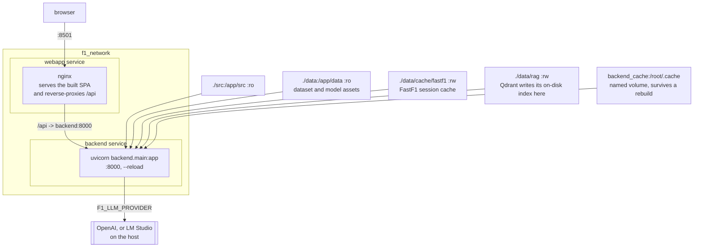

# Setup and Deployment

## Prerequisites

- Python 3.10-3.12 for the root project. The standalone telemetry submodule
  requires Python 3.11-3.12.
- Node.js 20.19+ or 22.12+ and npm (for the React and PITWALL builds / dev servers)
- Docker and Docker Compose (for containerized deployment)
- LM Studio or OpenAI API key (for LLM-powered agents)

## Local development

### 1. Clone and install

```bash
git clone https://github.com/VforVitorio/F1-StratLab.git
cd F1-StratLab
git submodule update --init --recursive   # src/telemetry/ is a submodule
uv sync --all-extras
```

`uv` is the project's package manager (the lockfile `uv.lock` is committed and CI runs `uv sync --frozen`); a bare `pip install -e .` will not resolve the pinned, CUDA-routed PyTorch wheel the way `uv sync` does.

### 2. Data

The CLI bootstraps the required data and model assets on first use with
`ensure_setup()`. In a source checkout, the default location is `data/`;
`F1_STRAT_DATA_ROOT` overrides it. Docker Compose does not bootstrap these
assets, so run the setup on the host before starting the web app:

```bash
uv run python -c "from src.f1_strat_manager.data_cache import ensure_setup; ensure_setup(show_progress=True)"
```

Manual download is also supported:

```
https://huggingface.co/datasets/VforVitorio/f1-strategy-dataset
```

Place contents under `data/` at the repo root. Expected layout:

```
data/
  raw/2025/<GP>/laps.parquet
  processed/laps_featured_2025.parquet
  models/lap_time/                 -- N06 XGBoost
  models/tire_degradation/         -- N09/N10 TireDegTCN
  models/overtake_probability/     -- N12 LightGBM
  models/safety_car_probability/   -- N14 LightGBM
  models/pit_prediction/           -- N15 HistGBT + N16 undercut
  models/nlp/                      -- pipeline_config_v1.json
  models/agents/                   -- agent config JSONs
  rag/                             -- Qdrant index
  tire_compounds_by_race.json
```

### 3. Environment variables

Create a `.env` file at the repo root:

| Variable | Required | Default | Description |
|---|---|---|---|
| `FRONTEND_URL` | no | `http://localhost:8501` | Frontend URL, read by the backend for CORS |
| `F1_LLM_PROVIDER` | no | per surface, see [INSTALL.md](https://github.com/VforVitorio/F1-StratLab/blob/main/INSTALL.md#llm-provider-per-surface) | Set to `openai` for OpenAI API |
| `OPENAI_API_KEY` | if provider=openai |, | OpenAI API key |
| `F1_STRAT_DATA_ROOT` | no | repo `data/` | Override the data directory. For first-run Hub downloads, the directory must end in `data/` because downloaded paths retain that prefix. |
| `F1_API_KEY` | no | unset | Shared secret for the `X-API-Key` header. Unset = unauthenticated (safe only on a loopback bind, see `F1_HOST` below) |
| `F1_HOST` | no | `127.0.0.1` | Host expected by the startup auth guard and used by the backend Dockerfile. It must match any Uvicorn `--host` override |
| `F1_MCP_ENABLED` | no | `false` | Mount the external `/mcp` Streamable-HTTP endpoint. The chat pipeline uses the same tools in-process regardless |
| `F1_CHAT_MAX_TOKENS` | no | `2048` | Server-side cap on completion tokens per chat turn |
| `F1_RATE_LIMIT_OFF` | no | unset | Set to `1` to disable the per-route rate limiter (load tests only) |

The webapp client does not read `BACKEND_URL`. Its optional `VITE_API_BASE`
setting is read by Vite from the webapp build environment, not from the
repository-root `.env`. Leave it empty for the same-origin `/api` route; the
Vite dev proxy targets `http://localhost:8000` and nginx proxies `/api` in
Compose.

See [Backend API reference → Authentication](#/backend-api) for how `F1_API_KEY` and `F1_HOST` interact.

### 4. Run the backend

```bash
uv run --project src/telemetry python -m uvicorn backend.main:app --app-dir src/telemetry --host 127.0.0.1 --port 8000 --reload
```

Verify at `http://localhost:8000/docs` (Swagger UI).

> **Keep the Compose stack on a trusted host.**
> `enforce_startup_security()` reads `F1_HOST`, not Uvicorn's actual command-line
> `--host`. Both Compose files pass `--host 0.0.0.0` and publish the backend and
> web app ports on all host interfaces. They leave `F1_HOST` at its loopback
> default. With `F1_API_KEY` unset, that configuration bypasses the guard and
> exposes an unauthenticated API on the published ports. The local command
> above binds directly to loopback.

### 5. Run the web app

```bash
cd src/telemetry/webapp
npm install && npm run dev   # Vite dev server, proxies /api to :8000
```

Open `http://localhost:5173`. The production path serves the built SPA
through nginx on `:8501` (see Docker below), launched with `f1-webapp`.

### 6. LM Studio (for LLM agents)

Start LM Studio with a model loaded, serving on `http://localhost:1234/v1`. The CLI and the backend fall back to this endpoint when `F1_LLM_PROVIDER` is unset; the arcade falls back to OpenAI instead ([INSTALL.md](https://github.com/VforVitorio/F1-StratLab/blob/main/INSTALL.md#llm-provider-per-surface)). Sub-agents use `gpt-4.1-mini`; the orchestrator uses `gpt-5.4-mini`.

## Docker deployment



Qdrant runs on disk inside the backend process. FastF1 writes session data to
`data/cache/fastf1`; Compose mounts both that cache and `data/rag` as writable.
The browser only talks to `:8501`; nginx reverse-proxies `/api` to the backend.

`f1-webapp` wraps `docker compose up` on this file. `F1_STRAT_DATA_ROOT=/app/data` is what makes the container agree with a local checkout about where data lives.

Two equivalent compose files exist, one at the repo root and one path-relative copy inside the submodule, both already mount volumes for live code reload and data access, so pick whichever working directory is convenient.

### Root `docker-compose.yml`

```bash
docker compose up --build
```

Services:

- backend: FastAPI on port 8000. Volumes: `./src:/app/src:ro` (read-only source,
  agents import from here), `./data:/app/data:ro` (data and model assets),
  `./data/cache/fastf1:/app/data/cache/fastf1:rw` (FastF1 session cache), and
  `./data/rag:/app/data/rag:rw` (writable RAG index, N30 may write here).
- webapp: React SPA served by nginx on port 8501; `/api` is reverse-proxied to `backend`, so the browser stays same-origin. Depends on `backend`.

`uv run f1-webapp` wraps this compose invocation and prints the URLs.

The `:ro` mounts mean agents must handle `OSError` / `PermissionError` gracefully when they attempt to create export directories inside the container.

### Telemetry `docker-compose.yml`

```bash
cd src/telemetry
docker compose up --build
```

Same two services, with paths relative to `src/telemetry/` instead of the repo root. The cutover (#43) is done: the **webapp** owns `:8501` in both compose files and the Streamlit service is gone (the legacy Streamlit app was later removed from the repo entirely, #551).

### Webapp Dockerfile (multi-stage)

The webapp Dockerfile has two stages:

1. **bun-builder**: `bun install --frozen-lockfile && bun run build` of the Vite + React SPA
2. **nginx**: serves the built assets and reverse-proxies `/api` to the backend service

### Backend Dockerfile

The backend image uses Python 3.11 and copies the pinned `uv` binary from the
official uv image. It copies `pyproject.toml` and `uv.lock` before the backend
source so Docker can reuse the dependency layer. The dependency layer runs
`uv sync --frozen --no-dev --no-install-project` and uses CPU PyTorch wheels on
Linux. The container puts `/app/.venv/bin` on `PATH`, so the Compose command
and the image command execute the locked `uvicorn` installation.

The host data directory remains read-only, except for the nested
`data/cache/fastf1` mount used by FastF1. The RAG directory remains writable.

## Building the RAG index

Before using the RAG Agent (N30), build the Qdrant vector index:

```bash
uv run python scripts/build_rag_index.py
```

This processes FIA Sporting Regulations PDFs and stores embeddings in `data/rag/`.
It also writes `data/rag/index_manifest.json`, which records the source PDF
hashes, model, vector dimension, chunking parameters, indexed years, and point
count. To create only that metadata for an existing local index, without loading
the embedding model or changing Qdrant points, run:

```bash
uv run python scripts/build_rag_index.py --manifest-only
```

The retriever warns when an old index has no manifest and refuses a present
manifest whose model, collection, or vector dimension does not match.

The current maintained Sporting Regulations corpus covers 2023-2026. The 2026
source is the official FIA [Section B Sporting Regulations, Issue 08, published
5 August 2026](https://www.fia.com/system/files/documents/fia_2026_f1_regulations_-_section_b_sporting_-_iss_08_-_2026-08-05_7.pdf).
The builder recognises its `B5.13.1`-style article identifiers and records the
source hashes and chunking decision in the manifest.

To reproduce the eval-gated chunking check without replacing the production
collection:

```bash
uv run python scripts/benchmark_rag_chunking.py
```

## Network architecture (Docker)

```
                    f1_network (bridge)
                    |                |
    webapp:8501  ---+                +-- backend:8000
    (nginx + SPA)   |                |   (FastAPI + uvicorn)
                    +-- LM Studio --+
                        :1234 (host)
```

The webapp's nginx reverse-proxies `/api` to `http://backend:8000` (Docker service name), so the browser stays same-origin. LM Studio runs on the host machine and is accessed at `http://host.docker.internal:1234/v1` or via host networking.
