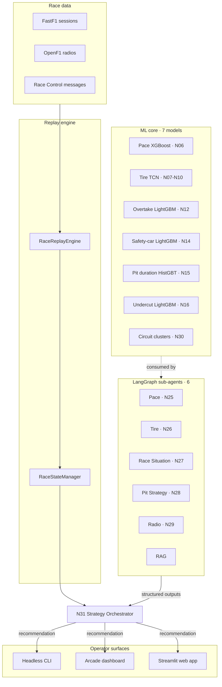

# Welcome to F1 StratLab

> Open-source multi-agent system that fuses seven machine-learning models, six LangGraph sub-agents and one strategy orchestrator into a single Formula 1 strategy recommender. Shipped under Apache-2.0.

This is the canonical technical reference for the F1 StratLab codebase. It is hand-curated and complements two sibling resources: the public landing at [f1stratlab.com](https://f1stratlab.com/) tells the project story for non-technical visitors, and the auto-generated [DeepWiki](https://deepwiki.com/VforVitorio/F1-StratLab) gives a notebook-per-notebook tour of the source tree. The pages here focus on the narratives those two cannot: **how the layers connect, why the contracts look the way they do, and what to do when something breaks**.

## The system at a glance

Three layers carry the system from raw telemetry to a strategy call: a machine-learning core, a multi-agent reasoning layer, and three operator surfaces. Each layer lives behind a documented contract, so any one can be swapped without disturbing the others.

## What lives where

The narratives on this site stop at the contract level. For per-file deep-dives — every function in `src/agents/`, every notebook from N06 to N34, every helper in `src/arcade/` — jump to the [F1 StratLab DeepWiki](https://deepwiki.com/VforVitorio/F1-StratLab). It is regenerated on every push to `main`.

## Project status

| Component | Version | Status |
|---|---|---|
| Multi-agent orchestrator (N31) | v1.0.0 | shipped |
| Arcade three-window MVP | v1.0.0 | shipped |
| Benchmark suite (Chapter 5) | v1.1.0 | shipped |
| Release automation (`release-please`) | v1.1.0 | shipped |
| Current release | v1.4.3 | shipped |

The current focus is documentation polish for the thesis defence; see the [project changelog](https://github.com/VforVitorio/F1-StratLab/blob/main/CHANGELOG.md) for the full history.
